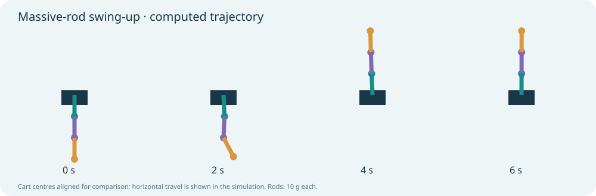

# Inverted Pendulum Control

**Louis Gosset · An educational numerical study of modelling, feedback and nonlinear swing-up.**

How can one horizontal cart force raise and balance three freely rotating links? This project connects Lagrange equations, state-space linearisation, controllability, Riccati-based LQR design and constrained nonlinear simulation.



**[Project overview](https://LGOSSET-21.github.io/inverted-pendulum-control/) · [Live demo](https://LGOSSET-21.github.io/inverted-pendulum-control/visualization/massive-swingup.html) · [Read the report](https://LGOSSET-21.github.io/inverted-pendulum-control/reports/Project_Report.pdf)**

## Start here

- **[Project report (PDF)](reports/Project_Report.pdf)** — detailed calculations; pages 1–7 cover the massless model and pages 8–9 the massive-rod extension and future work.
- **[Massive-rod swing-up](visualization/massive-swingup.html)** — **[open the live demonstration](https://LGOSSET-21.github.io/inverted-pendulum-control/visualization/massive-swingup.html)**. No download or installation needed.
- [Near-upright comparison](visualization/massive-rods.html) and [original interactive triple pendulum](visualization/triple.html).

The browser demonstrations work offline. Their display data are embedded; Python is required only to reproduce calculations. Mouse interaction belongs to the original massless model; the massive-rod demonstration currently plays verified saved trajectories.

## Results and scope

| Massive-rod experiment | Outcome |
|---|---|
| Three 10 g uniform rods added to existing endpoint masses | Suspended mass increases from 200 to 230 g |
| Aligned initial tilt of 1 degree | Settles at 2.1225 s |
| Swing-up from exactly hanging, at rest | Settles at 6.380 s |
| Maximum force and cart displacement during swing-up | 8 N and 0.721 m |
| Opposing initial tilts (+1, −1, +1 degrees) | Fails at the local experiment's tilt cutoff |

These are model-specific numerical results, not measured hardware performance or global stability guarantees. All hinges are passive. Rods are rigid, sensing and force actuation ideal, and collisions are not modelled. Cart viscous friction is included; joint friction, delay and sensor noise are not. The LQR stability statement applies locally to the unsaturated linearised system.

The massive model includes each rod's centre-of-mass translation, rotation with inertia **I = mL²/12**, and gravity. The swing-up is re-optimised for this model and independently replayed with saturation. It is not animation keyframing. [Derivation and reproduction details](docs/massive-rods.md).

## Reproduce

Python 3.11 and Node.js 20+ are recommended. Node is required for browser-physics cross-checks; no npm dependencies are needed.

```bash
python3 -m venv .venv
source .venv/bin/activate
python -m pip install -r requirements.txt
python -m unittest discover -s tests -v
node tests/test_massive_swingup_page.cjs
python src/build_massive_swingup.py
```

On Windows, activate with `.venv\Scripts\activate` instead. The saved massive-rod reference is included. Optional replanning (`python src/plan_massive_swingup.py`) may be slow and is not required to view or replay the result. `python src/build_massive_rods.py` rebuilds the near-upright comparison. Tests and planners may take several minutes.

Verification includes independent rigid-body energy calculations, mechanical power balance, the zero-rod-mass limit, finite-difference linearisation, Riccati checks, and halved integration steps. Original development recorded 25 passing Python tests; see the research log for the distinction between automated page checks and visual browser inspection.

## Repository contents

- `src/`: physical models, controllers, planners and page generators.
- `tests/`: numerical verification and browser-handler regression tests.
- `results/`: saved reference trajectories, CSVs and metrics.
- `visualization/`: offline demonstrations and editable templates.
- `docs/`: massive-rod derivation and numerical assumptions.
- `reports/`: professor-facing report.

## Future work — not yet implemented

1. Robustness maps for mass uncertainty, perturbed initial conditions and pushes during swing-up.
2. Noisy measurements, delays and state estimation.
3. Physical mouse interaction and recovery for the massive-rod model.
4. Compare precomputed trajectory tracking with online replanning/MPC; explore energy-based alternatives without assuming a simple-pendulum law transfers directly to three links.
5. Hardware identification and validation.

## Authorship and references

This is Louis Gosset's learning project. AI tools assisted implementation, debugging, mathematical explanations and report preparation. Established methods are not claimed as original inventions. The saved computations, tests and limitations support technical discussion; understanding and explaining the work remain part of the learning process.

Background: [University of Michigan CTMS — inverted pendulum](https://ctms.engin.umich.edu/CTMS/index.php?example=InvertedPendulum&section=SystemModeling), [MIT Underactuated Robotics](https://underactuated.mit.edu/). The chronological [research log](RESEARCH_LOG.md) includes superseded approaches; the README and model documentation describe the current scope.

## Companion project

[Next: physics-informed flow reconstruction](https://LGOSSET-21.github.io/pinn-hemodynamics/).
